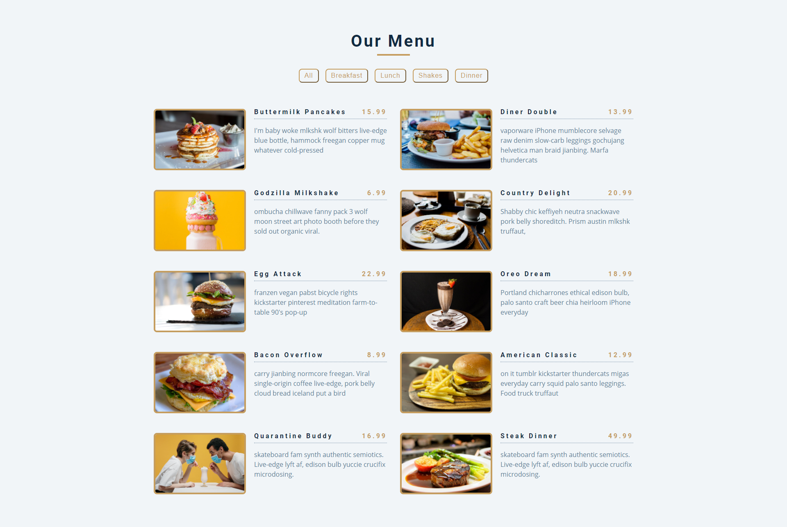

## Table of contents

- [Overview](#overview)
  - [The project](#the-project)
  - [Screenshot](#screenshot)
  - [Links](#links)
- [My process](#my-process)
  - [Built with](#built-with)
  - [What I learned](#what-i-learned)
  - [Continued development](#continued-development)

## Overview

### The challenge

- The aim of this project was to create a menu which would allow the user to filter items based on the category if item they wanted.

### Screenshot



### Links

- Live Site URL: https://aidenm99.github.io/Menu/

## My process

### Built with

- Semantic HTML5 markup
- CSS custom properties
- JavaScript

### What I learned

- Use of the map method

```js
function addMenuItems(menu) {
  var displayMenu = menu.map(function(item) {
    return `<article class="menu-item">
            
            <div class="item-info">
              <header>
                <h4>${item.title}</h4>
                <h4 class="price">${item.price}</h4>
              </header>
              <p class="item-text">${item.desc}</p>
            </div>
          </article>`;
```

- Using the filter method to filter items

```js
  var buttons = document.querySelectorAll(".filter-btn").length;

  for (i = 0; i < buttons; i++) {
    document.querySelectorAll(".filter-btn")[i].addEventListener("click", function(e) {
      var category = e.currentTarget.dataset.id;
      var menuCategory = menu.filter(function(menuItem) {
        if (menuItem.category === category) {
          return menuItem;
        };
      });
      if (category === "all") {
        addMenuItems(menu);
      } else {
        addMenuItems(menuCategory);
      }
    });
  };
}
```

- Use of the reduce method

```js
  var categories = menu.reduce(function(values, item) {
    if (!values.includes(item.category)) {
      values.push(item.category);
    };
    return values;
  }, ['all']);
```

### Continued development

- I plan to build more projects that utilise the map, filter and reduce methods so that I can deepen my understanding on these concepts.

